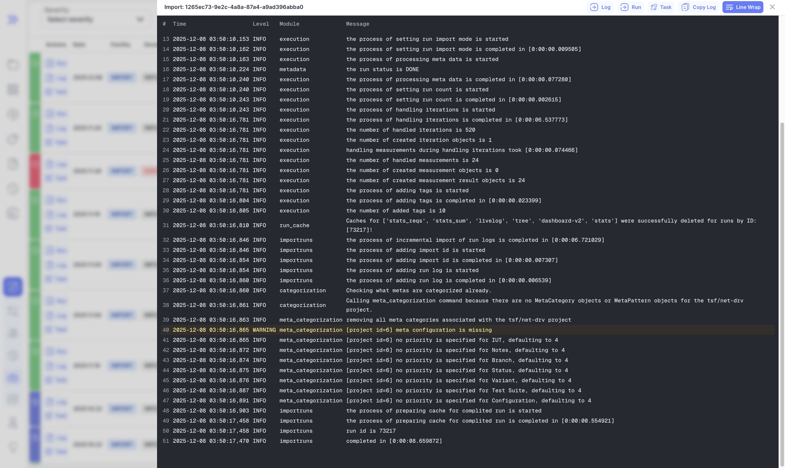
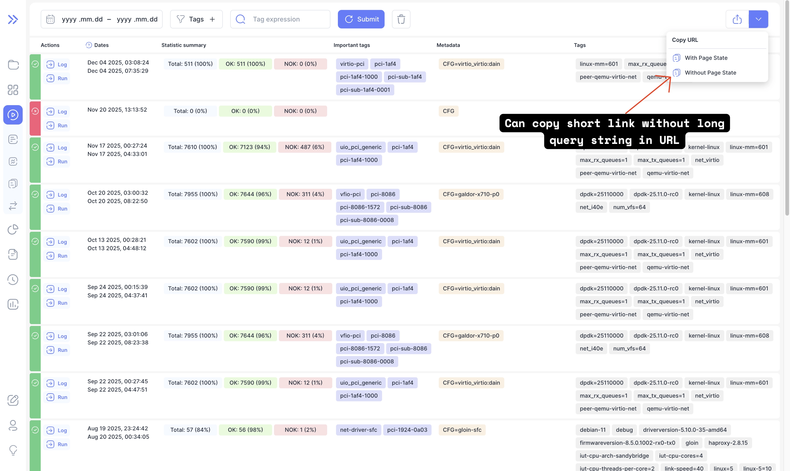

Bublik v2.5.0 brings improved navigation, cleaner short URLs, a more readable import log, and UI refinements like hiding empty argument blocks.  
This release also includes several bug fixes, minor enhancements, and an upgrade to Node v24.11 LTS.

### What's New

**Run Go To The Result**  
When going to the run details page, scroll to the result from which you are coming from if possible

**Improved Import Log**  
The import log now better formatted and highlights "ERROR" messages and "WARNING" messages

**Copy Short URL Without Page State**  
You can now copy a short URL to a page without the page state (long URL query string)

**Hide Empty Argument Values Block**  
On the report page, you hide argument values blocks that are empty

<!--truncate-->

## Highlights

### Go Straight To Result
import resultGif from './img/result.gif';

### Import Log

### Copy Short URL Without Page State

You can now copy a short URL to a page without the page state (long URL query string)

## Admin Section

### Backend Update

1. `cd bublik`
2. `git remote update`
3. `git checkout v2.5.0`
4. `./scripts/deploy --steps pip_requirements run_services`

### Frontend Update

1. Trigger the workflow in your frontend repository
2. Synchronize the mirrors
3. `cd bublik-ui`
4. `git remote update`
5. `git checkout v2.5.0`

### Documentation Update

1. Trigger the workflow in your frontend repository
2. Synchronize the mirrors
3. `cd bublik-docs`
4. `git remote update`
5. `git checkout v2.5.0`

### Docker Instance Update

1. `task backup:create`
2. Open your `.env` file and change `IMAGE_TAG` to `2.5.0`
5. `task pull`
6. `task up`

## Changelog

### Frontend

#### 🚀 New Feature

* **history:** [aggregation] add important tags to results hover card ([070e0b1](https://github.com/ts-factory/bublik-ui/commit/070e0b15794657280d3cc73610dc50dbd5859128))
* **log:** expand level up to row with `MI` level by default ([57f1cb8](https://github.com/ts-factory/bublik-ui/commit/57f1cb8de6bebfc04697c27c7f83ef5acf9174ba))
* **run:** add link to run straight to iteration ([831652d](https://github.com/ts-factory/bublik-ui/commit/831652d9c1b2d0dcbb10639f98f816d18d774364))
* **url:** add ability to copy short URL with page state or without ([816e8c8](https://github.com/ts-factory/bublik-ui/commit/816e8c8f8bdce555aaa45c88c1cf042dea4a5074))

###### 🐛 Bug Fix

* **history:** apply filter state on mount ([7acf814](https://github.com/ts-factory/bublik-ui/commit/7acf814b7d5280bc459f782d9e524f4ae4c44572))
* **import:** add missing react `key` prop to import events table ([34a2b03](https://github.com/ts-factory/bublik-ui/commit/34a2b0372db0b655b2548a132507e223b2101bf6))
* **report:** hide empty `arg-val-block` in report ([4f3fdbb](https://github.com/ts-factory/bublik-ui/commit/4f3fdbb1a038d4ce64a640f402018f5a4c1bb722))
* **run:** [result-table] fix parameters diff ([2bdb7bc](https://github.com/ts-factory/bublik-ui/commit/2bdb7bc177aed919964ff680d308a17b771859dd))

#### ♻ Code Refactoring

* **import:** [log] display log as a table with columns ([e7cde45](https://github.com/ts-factory/bublik-ui/commit/e7cde451a570c8ff7250d988ff75e4f195294e73))
* **version:** fix missing API version information ([d0c71a2](https://github.com/ts-factory/bublik-ui/commit/d0c71a2c0c7a8c3bdaf364b0ef878d956b3cc981))

#### 📦 Chores

* **deps:** upgrade node version to 24.11 LTS ([eb62198](https://github.com/ts-factory/bublik-ui/commit/eb62198f588213c2640d3131af6a7ccdc2de708a))

---

### Backend
